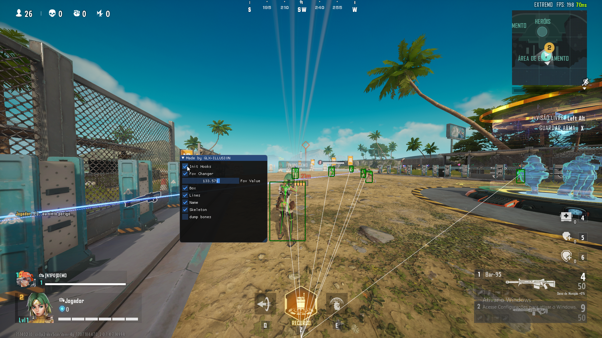

Unreal Internal Base
=====
Game example: Greed is Good - easy to use for any other Unreal SDK Game

This is an internal cheat project for Unreal Engine, with support for CheatGear SDK. The code has been developed in a simple and clean manner, utilizing the MinHook library for hooks. Additionally, the project includes a menu and a configuration system for a customized experience.

Features
Simple and Clean Code: The source code has been written in a simple and organized manner, making it easy to understand and maintain.

MinHook for Hooks: The MinHook library has been used to efficiently and safely implement hooks.

CheatGear SDK Support: The project includes support for the CheatGear SDK, allowing for the integration of additional functionalities.

Integrated Menu: An intuitive menu has been implemented to facilitate interaction and cheat configuration.

Configuration System: Easily customize the cheat through the included configuration system.

## Show Your Support

Feel free to submit pull requests improvements, bug fixes, or new features. Your contributions are greatly appreciated! 🌟

